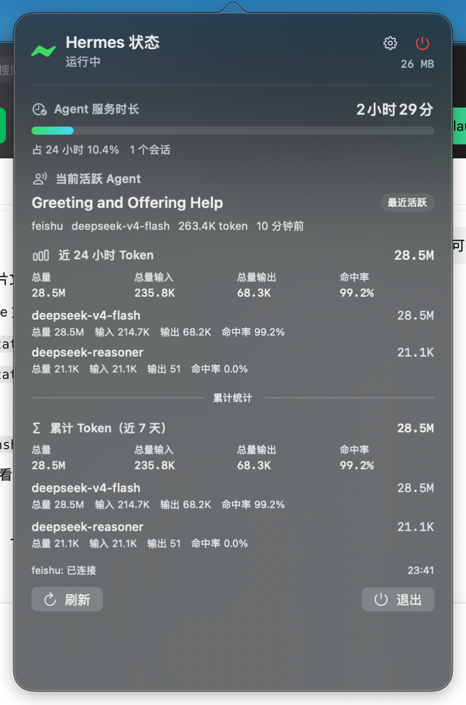

# Hermes Status Widget

一个 macOS 小工具，用来快速看本机 Hermes Agent 的状态。

它会显示：

- Hermes 是否在线
- Agent 今天服务了多久
- 最近 24 小时用了多少 token
- 不同模型分别消耗了多少
- 菜单栏里的详细状态
- 桌面小组件里的简洁状态

<p align="center">
  
</p>

<p align="center">
  
</p>

## 下载安装

1. 打开右侧或下方的 **Releases**。
2. 下载 `Hermes-Status-Widget-0.4.1.pkg`。
3. 双击安装。
4. 打开“应用程序”里的 **Hermes Status Widget**。
5. 菜单栏会出现 Hermes 状态；也可以在 macOS 小组件里搜索 **Hermes 状态**，添加到桌面。

如果 macOS 提示“无法验证开发者”，可以到 **系统设置 → 隐私与安全性** 里选择“仍要打开”。

## 适合谁

适合正在本机跑 Hermes Agent，又想随时看看状态的人。

这个工具只读取本机状态，不会修改 Hermes 的任何文件或数据。

## 常见问题

**小组件没有出现怎么办？**

先打开一次 **Hermes Status Widget**，再去 macOS 小组件库里搜索 **Hermes 状态**。

**数据没有立刻刷新怎么办？**

菜单栏下拉里点 **刷新**。桌面小组件由 macOS 系统调度刷新，可能会慢一点。

**没有数据怎么办？**

确认 Hermes Agent 已经在本机运行，并且 `~/.hermes` 目录里有状态文件。

## 给开发者

本项目是一个只读 macOS App：

- 主 App 常驻菜单栏，每 30 秒读取一次本机 Hermes 状态。
- WidgetKit 小组件读取主 App 写出的快照。
- 不调用 Hermes dashboard。
- 不写入 Hermes 的数据库或配置文件。

读取来源：

- `~/.hermes/gateway_state.json`
- `~/.hermes/gateway.pid`
- `~/.hermes/state.db`
- `ps` 命令读取网关内存占用

本地运行：

```sh
swift run HermesStatusWidget
```

构建 App：

```sh
chmod +x Scripts/build-app.sh
Scripts/build-app.sh
cp -R "dist/Hermes Status Widget.app" /Applications/
open "/Applications/Hermes Status Widget.app"
```

如果你使用非默认 Hermes 目录，可以启动前设置：

```sh
export HERMES_HOME=/path/to/.hermes
```

## License

MIT
